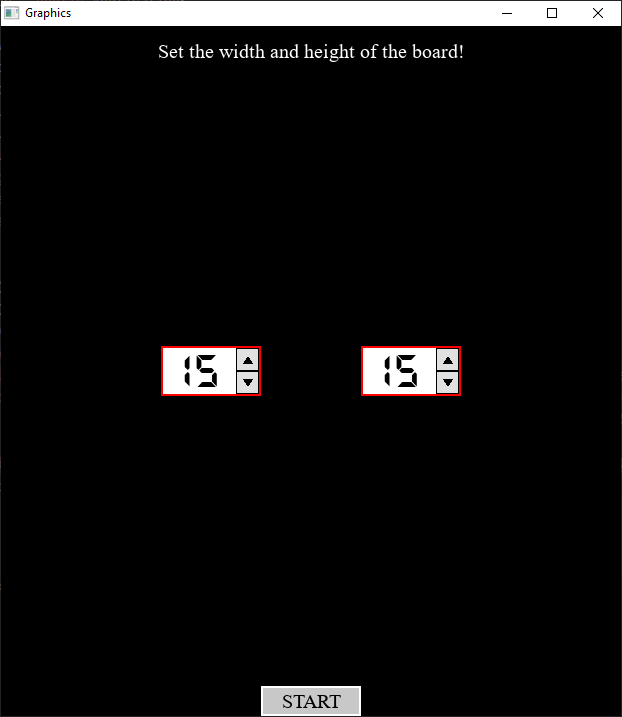
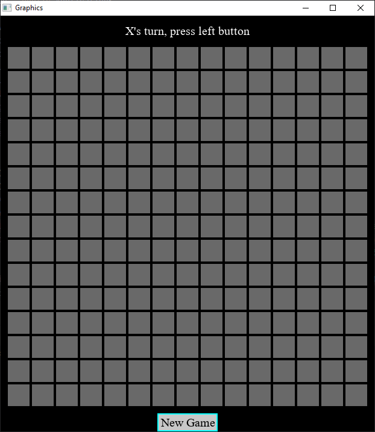
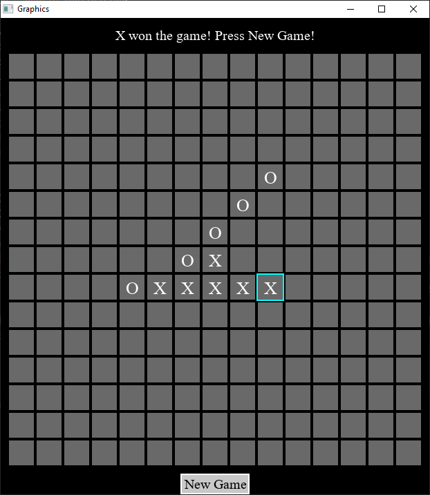

# TicTacToe
This game is an implementation of the good, old Tic-Tack-Toe with an own widget collection.
The game is written in C++ with the help of SDL2 and a wrapper layer above that. To make it work you should install SDL2.

# Some pictures from the game
- At the beginning you can set the board size:

- After starting a new game you will see the empty board:

- If any of the players win the game:

